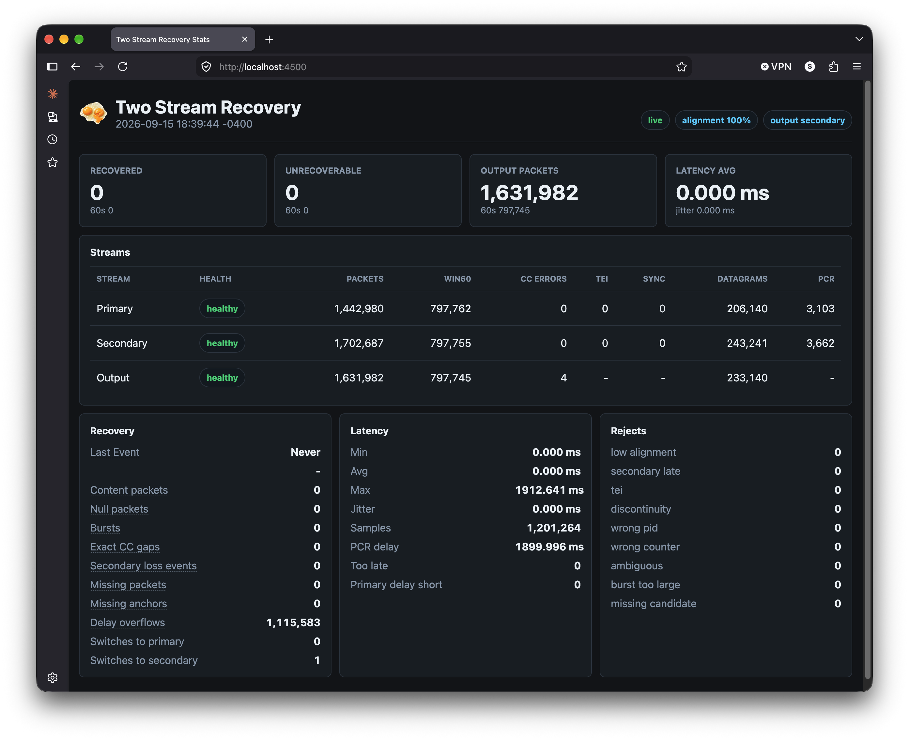

# Two Stream Recovery

`two_stream_recovery` repairs packet loss in an MPEG-TS MPTS stream by listening
to two delayed copies of the same transport stream. The primary input is treated
as the preferred source of truth, while the secondary input is used as a delayed
recovery witness when the primary stream has clear, recoverable loss.

The recovered stream is emitted as UDP MPEG-TS with exactly seven 188-byte
transport packets per datagram, for a 1316-byte UDP payload.



## What It Solves

Redundant MPEG-TS feeds often arrive with different latency. That delay is useful:
if the primary path drops packets, the secondary path may still deliver the same
packets a few seconds later. This tool buffers and compares both streams so it can
repair loss without blindly switching sources.

The recovery policy is intentionally conservative:

- Preserve stream #1 timing and content whenever it appears valid.
- Use stream #2 only when a missing packet or burst can be identified with high
  confidence.
- Recover content packets when continuity counters, alignment, timing, and packet
  identity agree.
- Recover null packet gaps when they are bounded by trusted anchors.
- Report ambiguous or unrecoverable cases instead of hiding them.
- Keep the output UDP payload fixed at seven TS packets per datagram.

The goal is a high-reliability repaired output stream, not aggressive source
switching.

## Build

Requirements:

- A C11 compiler such as `cc` or `clang`
- CMake 3.16 or newer
- POSIX sockets support

Build the tool:

```sh
cmake -S . -B build
cmake --build build
```

Run the unit test suite:

```sh
ctest --test-dir build --output-on-failure
```

Run an individual test:

```sh
ctest --test-dir build -R soak_replay --output-on-failure
```

Clean build products:

```sh
cmake --build build --target clean
```

## Basic Usage

At minimum, provide primary and secondary UDP inputs:

```sh
./two_stream_recovery \
  --input-primary-url udp://127.0.0.1:4501 \
  --input-secondary-url udp://127.0.0.1:4502
```

By default, output is sent to:

```text
udp://127.0.0.1:4500
```

A more complete command with the web UI enabled:

```sh
./two_stream_recovery \
  --input-primary-url udp://127.0.0.1:4501 \
  --input-secondary-url udp://127.0.0.1:4502 \
  --output-url udp://127.0.0.1:4503 \
  --primary-delay-ms 4000 \
  --max-secondary-latency-ms 5000 \
  --alignment-window-ms 6000 \
  --history-ms 12000 \
  --primary-outage-ms 500 \
  --primary-return-ms 120000 \
  --max-content-burst-packets 255 \
  --min-alignment-confidence 0 \
  --http-port 4500
```

Then open:

```text
http://127.0.0.1:4500/
```

The REST stats endpoint is available at:

```text
http://127.0.0.1:4500/api/stats
```

## Live Test Target

For local development, CMake provides:

```sh
cmake --build build --target live-test
```

This starts the tool with:

- Primary input: `udp://127.0.0.1:4501`
- Secondary input: `udp://127.0.0.1:4502`
- Recovered output: `udp://127.0.0.1:4503`
- Web UI and API: `http://127.0.0.1:4500/`

The live-test parameters are tuned for primary and secondary streams that may be
two to three seconds apart.

## Important Options

`--input-primary-url <url>`  
Required. UDP URL for stream #1, the preferred source.

`--input-secondary-url <url>`  
Required. UDP URL for stream #2, the delayed recovery witness.

`--input-primary-interface <ipv4>` and `--input-secondary-interface <ipv4>`  
Local interface addresses used when joining multicast groups.

`--output-url <url>`  
UDP destination for the repaired output. Default: `udp://127.0.0.1:4500`.

`--http-port <number>`  
Enable the local REST API and dark web UI on `127.0.0.1:<number>`.

`--console-report`  
Print per-second console statistics. By default, console reporting is disabled.

`--primary-delay-ms <ms>`  
Delay applied to the primary stream before output so the secondary stream has
time to arrive and provide recovery candidates.

`--max-secondary-latency-ms <ms>`  
Maximum trusted primary-to-secondary latency for recovery matches.

`--alignment-window-ms <ms>`  
Arrival-time search window used while comparing packets for stream alignment.

`--history-ms <ms>`  
Rolling packet history target used to size recovery buffers.

`--primary-outage-ms <ms>`  
Silence on stream #1 before output fails over to stream #2. The default is
500 ms.

`--primary-return-ms <ms>`  
Healthy stream #1 warm-up time before returning from stream #2. The default is
120000 ms, so primary has to be back for two quiet minutes before it is
preferred again.

`--max-content-burst-packets <count>`  
Maximum number of content packets to recover in one conservative burst.

`--min-alignment-confidence <0-100>`  
Minimum alignment confidence before content recovery is allowed.

Use `./two_stream_recovery --help` for the current full option list.

## Web UI

The web UI is served from `webroot/` when `--http-port` is enabled. It updates
once per second and shows:

- Primary, secondary, and output stream health
- Packet counts and 60-second windows
- Continuity, TEI, sync, datagram, and PCR counters
- Recovery counters, including the last recovery event date and time
- Latency measurements between the delayed streams
- Recovery reject reasons for troubleshooting

Hover over Recovery panel fields for plain-English help about what each value
means and whether higher or lower values are good.

## Recovery Signals

Useful indicators while testing:

- `Recovered`: packets successfully inserted from the secondary stream.
- `Unrecoverable`: loss that could not be repaired safely.
- `Output`: total TS packets sent downstream.
- `Last Event`: date and 24-hour time of the most recent recovery.
- `CC Errors`: continuity counter problems seen on input or output.
- `PCR delay`: measured PCR timing difference between primary and secondary.
- `Alignment`: confidence that both inputs are synchronized copies.

During a clean run, recovery counters should normally remain at zero. When you
intentionally drop packets on the primary input, recovered content or null packet
counters should increase if the secondary stream still has the missing packets
and the recovery evidence is strong enough.

## Multicast Example

```sh
./two_stream_recovery \
  --input-primary-url udp://239.10.10.1:4100 \
  --input-secondary-url udp://239.10.10.2:4101 \
  --input-primary-interface 192.168.1.50 \
  --input-secondary-interface 192.168.1.50 \
  --output-url udp://127.0.0.1:4500 \
  --http-port 8080
```

Multicast UDP inputs automatically join the configured groups with IGMP.

## Project Layout

- `src/main.c` - process loop and socket polling
- `src/command_line.c/h` - command-line parsing
- `src/input_udp.c/h` - UDP input and multicast join handling
- `src/output_udp.c/h` - fixed-size UDP MPEG-TS output
- `src/recovery_engine.c/h` - stream alignment, buffering, and recovery decisions
- `src/report_stats.c/h` - counters, rolling windows, JSON, and console reporting
- `src/web_server.c/h` - embedded REST/static web server
- `webroot/` - HTML, CSS, JavaScript, and UI assets
- `tests/` - unit and soak tests
